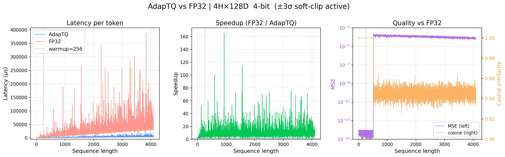

<div align="center">
  <h1>AdapTQ</h1>
  <p><b>Adaptive Streaming Vector Quantization KV Cache for LLMs</b></p>

  <a href="https://pypi.org/project/adaptq/">
    
  </a>
  <a href="https://github.com/l3tchupkt/adaptq/actions/workflows/integration.yml">
    
  </a>
  <a href="https://pypi.org/project/adaptq/">
    
  </a>
  <a href="https://github.com/l3tchupkt/adaptq/blob/main/LICENSE">
    
  </a>
  <a href="https://github.com/l3tchupkt/adaptq">
    
  </a>
</div>

<br>

**AdapTQ** is a production-grade C++17 KV cache quantization engine for Large Language Model inference on edge and memory-constrained systems.

It runs entirely on the CPU, requires **no model changes**, and fits seamlessly into existing inference pipelines (Hugging Face Transformers, llama.cpp, Ollama) with minimal wrapper logic. By leveraging Fast Walsh-Hadamard Transforms (FWHT) and branchless SIMD optimizations, AdapTQ achieves **4–8× KV memory reduction** while matching or exceeding FP16 attention throughput at large context lengths.

## ✨ Key Features

- **Extreme Memory Compression**: 4–8× smaller KV cache footprints via 2-bit, 3-bit, and 4-bit Max-Lloyd quantization.
- **Unified SIMD Pipeline**: 2/3/4-bit decoding shares a single, quad-unrolled branchless loop using AVX2 intrinsics. No scalar fallbacks.
- **Hybrid Execution**: Automatically routes short sequences (≤ 256 tokens) to FP32 and long sequences to quantized SIMD, maximizing speed without data copying.
- **Multi-Backend Support (V2.1)**: Drop-in wrappers for `transformers` and `llama-cpp-python`.
- **Deterministic Replay (V2)**: Save `.aqss` session snapshots to disk, branch conversations at any token, and perfectly replay states with zero context-recomputation overhead.

---

## 🚀 Quick Start

### 1. Installation

Install directly from PyPI (includes pre-built C++ extensions for Linux/Windows/macOS):

```bash
pip install adaptq
```

_To install with specific backend dependencies:_

```bash
pip install adaptq[transformers]   # For Hugging Face support
pip install adaptq[llama]          # For llama-cpp-python support
pip install adaptq[all-backends]   # Install all supported integrations
```

### 2. Hugging Face Transformers Integration

AdapTQ seamlessly injects itself into any standard `transformers` generation pipeline:

```python
import torch
from transformers import AutoModelForCausalLM, AutoTokenizer
from adaptq import create_adapter

model_id = "Qwen/Qwen2-0.5B"
tokenizer = AutoTokenizer.from_pretrained(model_id)
model = AutoModelForCausalLM.from_pretrained(model_id, torch_dtype=torch.float32)

# Wrap the model with AdapTQ (4-bit quantization, 2048 capacity)
adapter = create_adapter("transformers", model=model, bits=4, capacity=2048)

# Generate normally! The KV cache is now fully compressed and managed in C++.
inputs = tokenizer("The future of AI on edge devices is", return_tensors="pt")
outputs = model.generate(**inputs, max_new_tokens=50)
print(tokenizer.decode(outputs[0]))
```

### 3. llama.cpp Integration

For ultra-fast GGUF edge inference, wrap your `Llama` instance:

```python
from llama_cpp import Llama
from adaptq import create_adapter

llm = Llama(model_path="models/qwen2-0.5b.Q4_K_M.gguf", n_ctx=2048)

# Hook AdapTQ into llama.cpp's evaluation loop
adapter = create_adapter("llama_cpp_python", model=llm, bits=4)

response = llm.create_completion("Hello, how does KV quantization work?", max_tokens=100)
print(response["choices"][0]["text"])
```

---

## 📊 Performance & Architecture

At large context lengths, attention becomes profoundly memory-bandwidth bound. AdapTQ mitigates this by compressing the KV cache, significantly reducing the bytes fetched from RAM during generation.

| Metric                          | FP16 Baseline | AdapTQ (4-bit) | Improvement        |
| :------------------------------ | :------------ | :------------- | :----------------- |
| **Memory per Token (d=128)**    | 512 bytes     | 64 bytes       | **8.0× smaller**   |
| **Throughput (Seq > 2k)**       | ~720 tok/s    | ~1,139 tok/s   | **1.5× faster**    |
| **Cosine Similarity (Quality)** | 1.000         | 0.947          | Minimal Distortion |


_(Figure: Real-world benchmark of AdapTQ 4-bit vs FP32 showcasing bounded latency, substantial speedups at high sequence lengths, and hybrid-fallback quality maintenance.)_

### How it works (HAR + VQ)

1. **Rotation**: `y = (1/√d) * H * D * x` (Hadamard Accelerated Rotation via FWHT). This smooths outliers, transforming the input distribution to near-Gaussian.
2. **Quantization**: Vectors are scalar-quantized using optimal Max-Lloyd codebooks.
3. **Inference**: Queries are rotated once; dot products execute directly against bit-packed LUTs using AVX2 SIMD instructions, completely bypassing full dequantization inside the hot attention loop.

---

## ⏪ Replay & Compare CLI (V2)

AdapTQ introduces `.aqss` (AdapTQ Session Snapshot) binary files. You can save exact conversational states and branch them instantaneously.

### Using the Python API:

```python
from adaptq import ReplayEngine, snapshot_info

# Inspect a saved session
print(snapshot_info("chat_session.aqss"))

# Replay deterministically and branch from token 128
engine = ReplayEngine()
result = engine.replay("chat_session.aqss", from_token=128)
print(f"Replayed in {result.wall_time_ms} ms")
```

### Using the C++ CLI:

Compare the quality and latency of different quantization strategies on real sessions:

```bash
# Build the native CLI
cmake -B build_release -S . -DCMAKE_BUILD_TYPE=Release
cmake --build build_release --parallel

# Compare FP32 vs 4-bit Quantization
./build_release/adapTQ_demo compare chat_session.aqss \
  --strategies har_fixed,fp_passthrough \
  --format md
```

---

## 📚 Project Structure

- `core/`: Highly optimized SIMD FWHT and Max-Lloyd codebooks.
- `attention/`: Hybrid execution attention loops.
- `adapters/`: Native C++ pybind11 integration layer.
- `runtime/`: Session orchestration and dynamic plugin registry.
- `replay/`: `.aqss` session snapshot serialization and branching engine.
- `adaptq/runtime_py/`: Python multi-backend registry (`transformers`, `llama_cpp_python`).
- `examples/`: Ready-to-run integration demos.

For source builds, local development, testing, and contribution guidelines, see
[CONTRIBUTING.md](CONTRIBUTING.md).

---

## ❓ FAQ & Troubleshooting

**Q: My model outputs gibberish when using 2-bit quantization.**

> A: 2-bit quantization is highly aggressive (16x compression). It is recommended only for robust, large-scale models (>7B parameters) or for highly structured summarization tasks. Stick to `bits=4` for standard chat models like Qwen2-0.5B or TinyLlama.

**Q: Does AdapTQ require CUDA/GPU?**

> A: No. AdapTQ is explicitly designed for **CPU edge inference**. It relies heavily on AVX2/FMA instructions found on standard x86 processors. ARM NEON support is planned for future roadmaps.

**Q: C++ compilation fails with `unrecognized command line option '-mavx2'`**

> A: Your compiler or architecture does not support AVX2. AdapTQ currently requires an x86_64 CPU with AVX2 and FMA extensions.

---

## 📜 Citation

If you use AdapTQ in your research, please cite:

```bibtex
@software{adaptq2026,
  author = {Lakshmikanthan K.},
  title = {AdapTQ: Adaptive Streaming Vector Quantization for Edge-Deployed Large Language Models},
  year = {2026},
  url = {https://github.com/l3tchupkt/adaptq}
}
```

## 📄 License

This project is licensed under the [MIT License](LICENSE).
